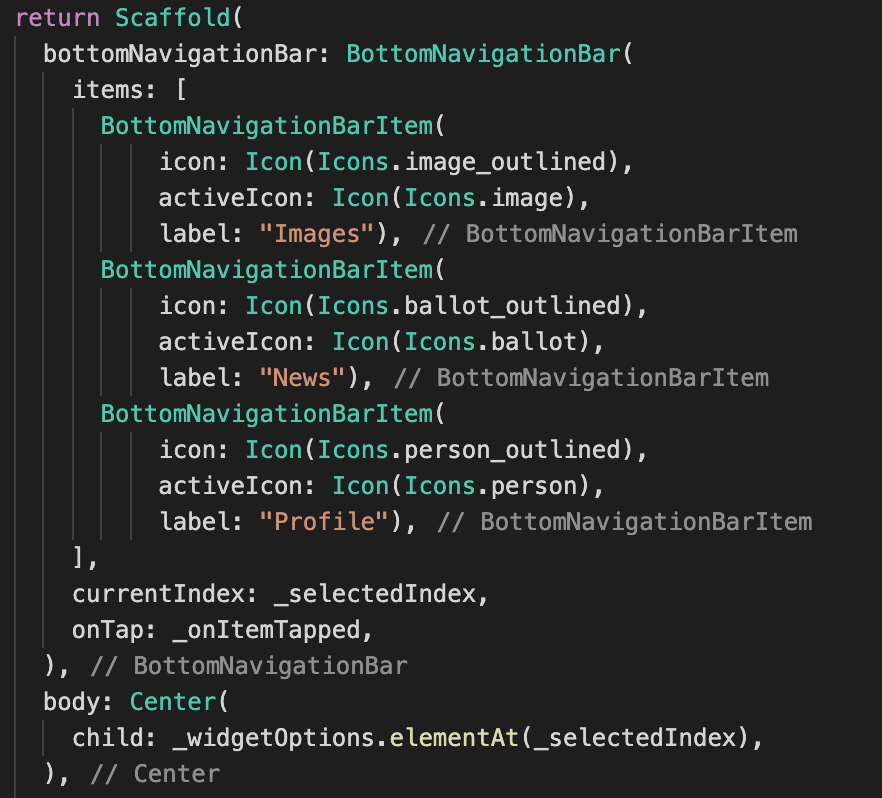
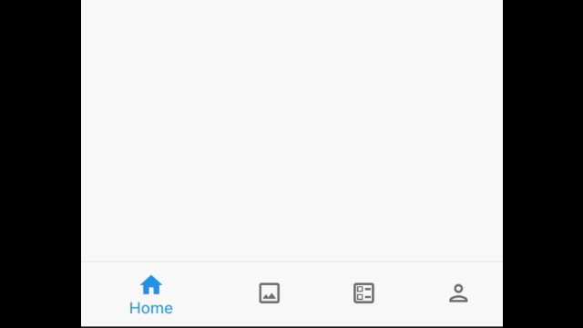
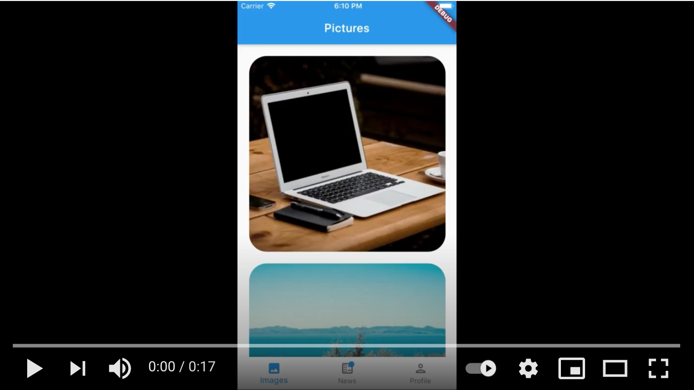

# BottomNavigationBar

La [**BottomNavigationBar**](https://api.flutter.dev/flutter/material/BottomNavigationBar-class.html) es el widget de la [Material Library](https://api.flutter.dev/flutter/material/material-library.html) de Flutter que nos permite crear fácilmente una barra de navegación en la parte inferior de la aplicación. Dicha barra, de forma similar a la [TabBar](https://api.flutter.dev/flutter/material/TabBar-class.html), ofrece una navegación rápida entre subpantallas de la aplicación que se quieran tener a un mismo nivel.

## Motivación

Muchas de las aplicaciones más populares, como podrían ser [Instagram](https://www.instagram.com/), [AirBnB](https://www.airbnb.com/) o [LinkedIn](https://www.linkedin.com/), usan este tipo de barras de navegación inferiores para ofrecer un **menú de acceso ágil, sencillo, visual y "thumb-friendly"** a sus usuarios.

- :bulb: Todas las apps deberían ser "user-friendly", auto-descriptivas e intuitivas, dado que el usuario no leerá instrucciones para utilizarlas.

- :point_right: La presencia de esta barra en el nivel principal de la aplicación ayuda a informar al usuario de las funcionalidades más representativas que le ofrece la app.

- :+1: Y su ubicación, en la parte inferior, la hace más rápida y cómoda de utilizar que menús superiores.

  > La vista del usuario siempre acaba dirigiéndose hacia abajo y, si se éste está sujetando el móvil con una sola mano, es mejor que la navegación básica pueda realizarse usando simplemente el dedo pulgar .

## ¿Cómo la incorporamos a una app?

Normalmente la usamos conjuntamente con [Scaffold](https://api.flutter.dev/flutter/material/Scaffold-class.html), que ya tiene un atributo especial para ella llamado [bottomNavigationBar](https://api.flutter.dev/flutter/material/Scaffold/bottomNavigationBar.html).

## Algunas propiedades a destacar:

- **items**

  La BottomNavigationBar está formada por una especie de botones o elementos. Se trata de widgets del tipo [BottomNavigationBarItem](https://api.flutter.dev/flutter/widgets/BottomNavigationBarItem/BottomNavigationBarItem.html), que nos permiten configurar su apariencia con un icono y una etiqueta (e incluso indicar distintos iconos, colores, tamaños o comportamientos dependiendo de si el elemento está seleccionado o no).

  Las recomendaciones de [Material Design](https://material.io/components/bottom-navigation#usage) indican que el número de elementos mostrados en la barra no debería ser muy grande, típicamente **entre 3 y 5 elementos**.

- **type**

  Define el diseño y comportamiento de la BottomNavigationBar. Cuando hay menos de 4 elementos, su valor por defecto es [BottomNavigationBarType.fixed](https://api.flutter.dev/flutter/material/BottomNavigationBarType-class.html). Mientras que cuando hay 4 elementos o más, su valor por defecto es [BottomNavigationBarType.shifting](https://api.flutter.dev/flutter/material/BottomNavigationBarType-class.html).

  Ejemplo del tipo Fixed:
  

  Ejemplo del tipo Shifting:
  

- **currentIndex**

  Sirve para indicar qué elemento de la BottomNavigationBar es el que está activo/seleccionado.

- **onTap**

  Se llama cuando uno de los elementos de la BottomNavigationBar es pulsado. Aquí indicaremos qué hacer cuando esto suceda (normalmente, consistirá en actualizar el índice de elemento seleccionado y, en consecuencia, la subpantalla asociada a éste).

## Ejemplo

En el proyecto implementado para demostrar el uso de este widget:

1. Se ha creado una BottomNavigationBar de 3 elementos.
2. Se ha configurado para solo se muestre la etiqueta del elemento seleccionado.
3. Se le ha incorporado la posibilidad de tener un "badge" (una especie de marcador para avisar que hay novedades en esa sección) a uno de los elementos.
4. Se ha especificado que el título cambie en función del elemento seleccionado para mostrar la etiqueta de la sección activa.

## Consideraciones finales

- No se recomienda usar esta barra si solo quieren ofrecerse 2 opciones o elementos. En este caso mejor usar la [TabBar](https://api.flutter.dev/flutter/material/TabBar-class.html).

- No se recomienda usar esta barra para más de 5 elementos. En este caso, mejor usar un menú lateral o un menú de navegación desplegable.

- La BottomNavigationBar está pensada para poder dirigir al usuario a unas pocas destinaciones. Si se desea una barra inferior con un uso distinto, que permita hacer tareas concretas o incorporar un botón flotante, se recomienda usar la [BottomAppBar](https://api.flutter.dev/flutter/material/BottomAppBar-class.html).

## Referencias

- [Flutter Api: BottomNavigationBar](https://api.flutter.dev/flutter/material/BottomNavigationBar-class.html)

- [Flutter Api: BottomNavigationBarItem](https://api.flutter.dev/flutter/widgets/BottomNavigationBarItem-class.html)

- [Material Design: Bottom navigation](https://material.io/components/bottom-navigation)
